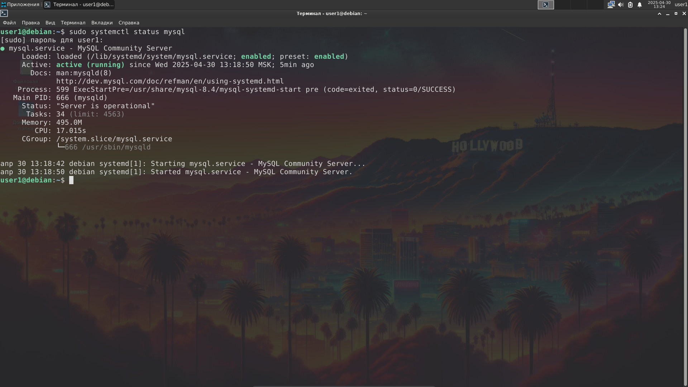
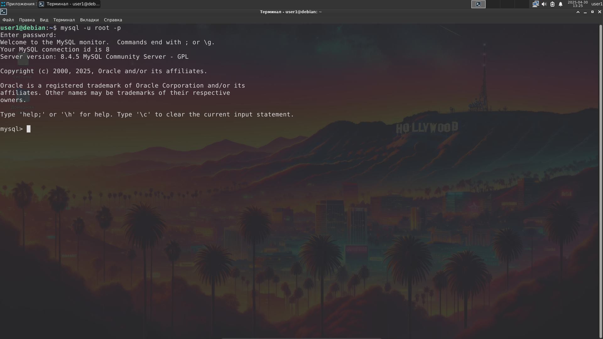
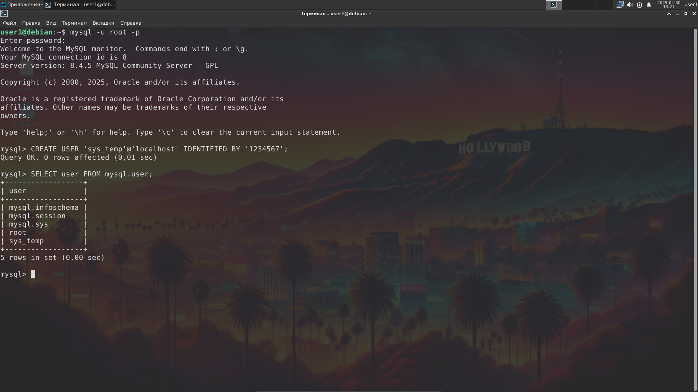
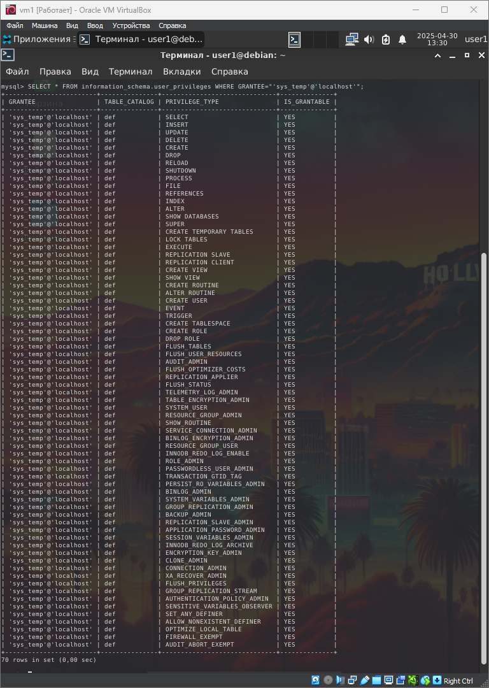
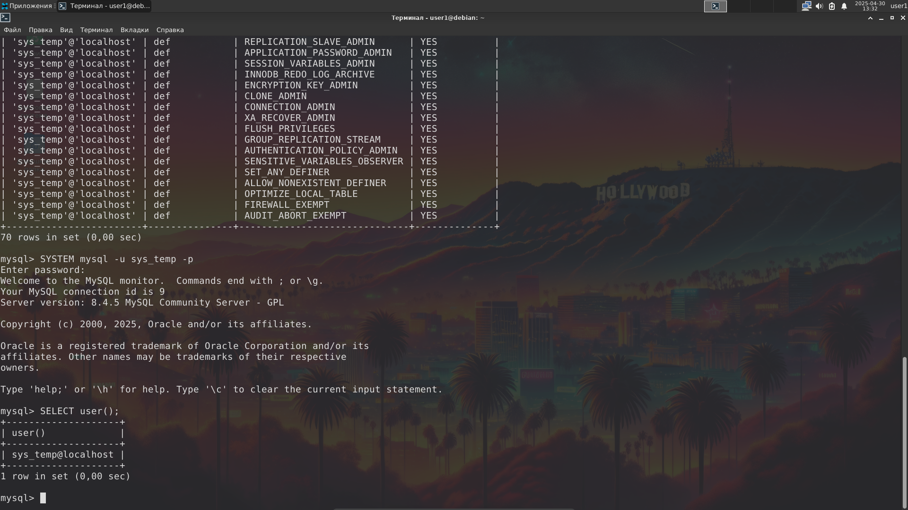
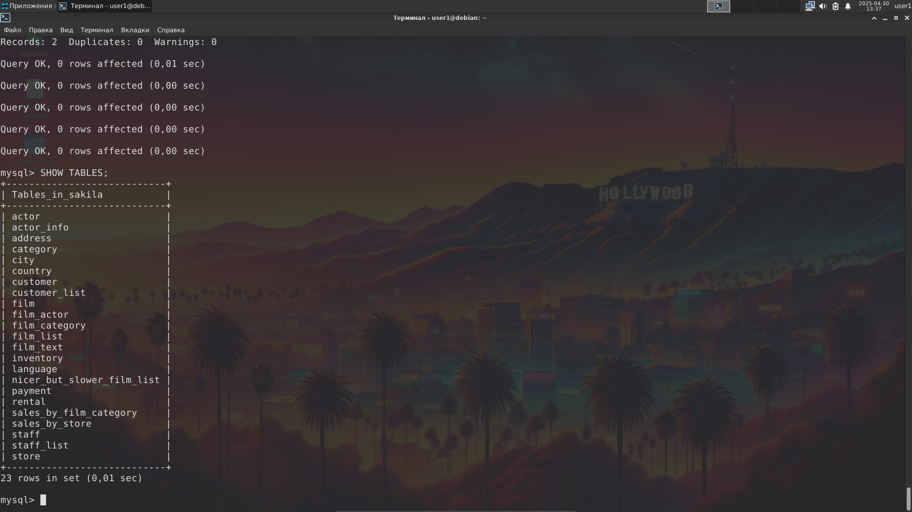
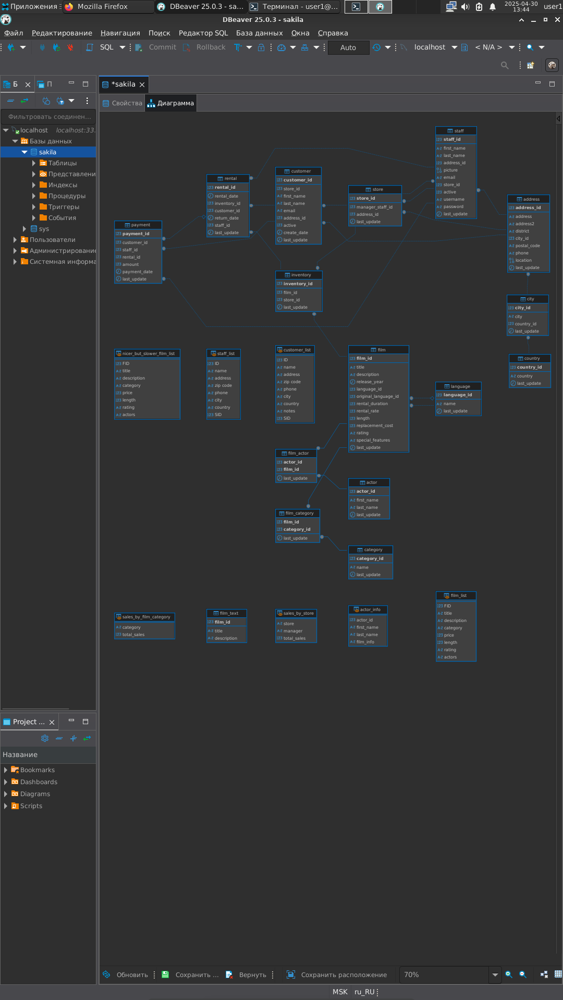
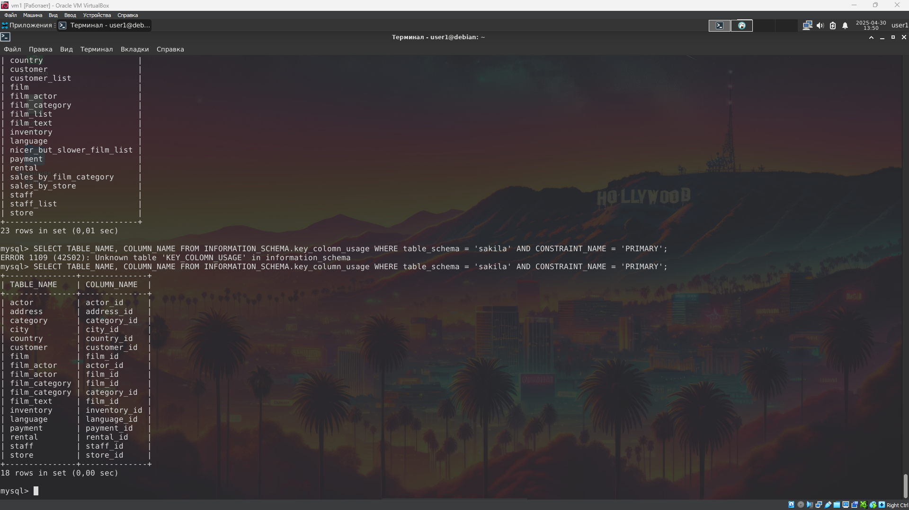

# Домашнее задание к занятию «Работа с данными (DDL/DML)» - Сергей Максимов

## Задание 1

1. **Поднимите чистый инстанс `MySQL версии 8.0+`. Можно использовать локальный сервер или контейнер Docker.**

    ```
    $ sudo apt install mysql-server

    $ sudo systemctl status mysql

    $ mysql -u root -p
    ```

    

    

2. **Создайте учётную запись `sys_temp`.**

    ```
    > CREATE USER 'sys_temp'@'localhost' IDENTIFIED BY '1234567';
    ```

3. **Выполните запрос на получение списка пользователей в базе данных. (скриншот)**

    ```
    > SELECT user FROM mysql.user;
    ```

    

4. **Дайте все права для пользователя `sys_temp`.**

    ```
    > GRANT ALL PRIVILEGES ON *.* TO 'sys_temp'@'localhost' WITH GRANT OPTION;
    ```

5. **Выполните запрос на получение списка прав для пользователя `sys_temp`. (скриншот)**

    ```
    > SELECT * FROM information_schema.user_privileges WHERE GRANTEE="'sys_temp'@'localhost'";
    ```

    

6. **Переподключитесь к базе данных от имени `sys_temp`.**

    ```
    $ SYSTEM mysql -u sys_temp -p
    
    $ SELECT user();
    ```

    

7. **По ссылке `https://downloads.mysql.com/docs/sakila-db.zip` скачайте дамп базы данных.**

8. **Восстановите дамп в базу данных.**

    ```
    $ source /home/tverdyakov/sakila-db/sakila-schema.sql

    $ source /home/tverdyakov/sakila-db/sakila-data.sql
    ```

9.  **При работе в IDE сформируйте ER-диаграмму получившейся базы данных. При работе в командной строке используйте команду для получения всех таблиц базы данных. (скриншот)**

    

    

## Задание 2

Составьте таблицу, используя любой текстовый редактор или Excel, в которой должно быть два столбца: в первом должны быть названия таблиц восстановленной базы, во втором названия первичных ключей этих таблиц. Пример: (скриншот/текст)

Название таблицы | Название первичного ключа
customer         | customer_id

### Ответ

```
> SELECT TABLE_NAME, COLUMN_NAME FROM INFORMATION_SCHEMA.key_column_usage WHERE table_schema = 'sakila' AND CONSTRAINT_NAME = 'PRIMARY';
```



```
+---------------+--------------+
| TABLE_NAME    | COLUMN_NAME  |
+---------------+--------------+
| actor         | actor_id     |
| address       | address_id   |
| category      | category_id  |
| city          | city_id      |
| country       | country_id   |
| customer      | customer_id  |
| film          | film_id      |
| film_actor    | actor_id     |
| film_actor    | film_id      |
| film_category | film_id      |
| film_category | category_id  |
| film_text     | film_id      |
| inventory     | inventory_id |
| language      | language_id  |
| payment       | payment_id   |
| rental        | rental_id    |
| staff         | staff_id     |
| store         | store_id     |
+---------------+--------------+
```